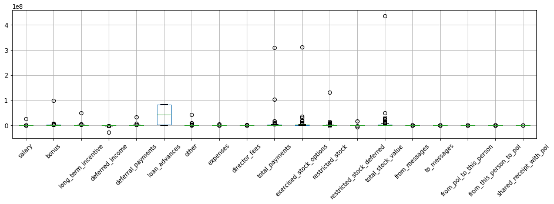
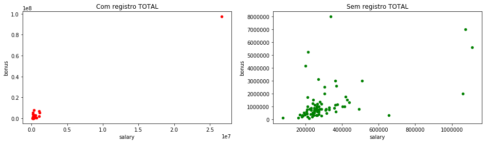
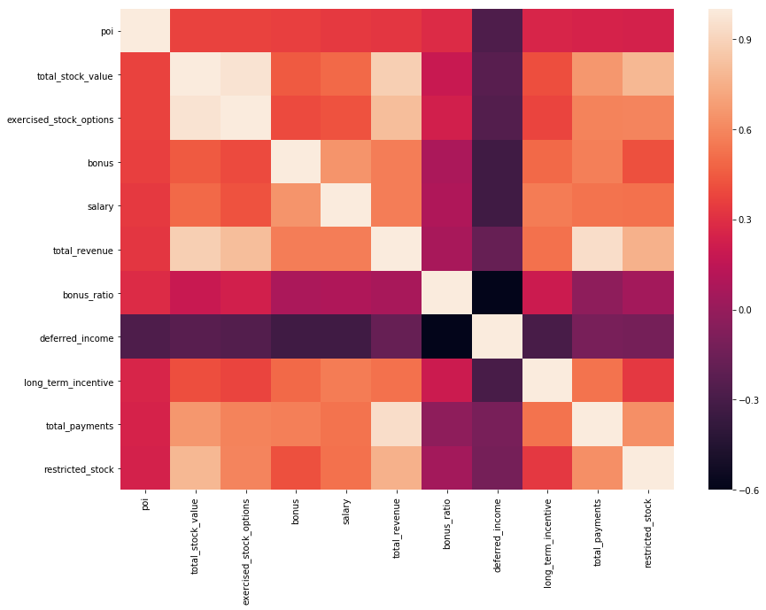

# Projeto Final - Detecção de Fraude via Emails da Enron

## Introdução

Este é o projeto final das aulas de Introdução ao Aprendizado de Máquinas do curso de _Data Science for Business_ da
Udacity. Para este trabalho iremos analisar um conjunto de dados de email e informações financeiras da Enron.

A Enron foi uma empresa americana fundada em 1985 com foco na exploração de gás natural e produção de energia de diversos tipos. Em 2001 a empresa é parte de uma das maiores fraudes da história. A partir da revelação do escandalo da Enron, a empresa tem sucessivas quedas em suas ações e pede concordata deste mesmo ano.

O principal objetivo deste projeto é desenvolver um algoritimo que detecte pessoas envolvidas no escandalo da Enron baseado no conjunto de dados disponíveis de funcionários de alto escalão e diretores da Enron.


```python
import numpy as np
import pandas as pd
import matplotlib.pyplot as plt
import seaborn as sns

%matplotlib inline

import pickle
import sys
sys.path.append("../tools/")

import warnings
warnings.filterwarnings("ignore")

from feature_format import featureFormat, targetFeatureSplit
from tester import dump_classifier_and_data, test_classifier
```

    /Users/daniteo/miniconda3/envs/udacity2/lib/python2.7/site-packages/sklearn/cross_validation.py:41: DeprecationWarning: This module was deprecated in version 0.18 in favor of the model_selection module into which all the refactored classes and functions are moved. Also note that the interface of the new CV iterators are different from that of this module. This module will be removed in 0.20.
      "This module will be removed in 0.20.", DeprecationWarning)


## Analise dos dados e Remoção de outliers

O primeiro passo deste trabalho é uma analise dos dados disponíveis com o intuito de identificar informações  faltantes ou fora do padrão. Para esta analise farei a carga das informações disponíveis no arquivo `final_project_dataset.pkl`.

Por meio da análise de dados feita nesta seção tentarei identificar registros que precisam ser removidos do nosso dataset para um funcionamento adequado do algoritmo utilizado para as predições de POI. 


```python
### Load the dictionary containing the dataset
with open("final_project_dataset.pkl", "r") as data_file:
    data_dict = pickle.load(data_file)
    
enron_df = pd.DataFrame.from_dict(data_dict, orient = 'index')

enron_df.info()
```

    <class 'pandas.core.frame.DataFrame'>
    Index: 146 entries, ALLEN PHILLIP K to YEAP SOON
    Data columns (total 21 columns):
    salary                       146 non-null object
    to_messages                  146 non-null object
    deferral_payments            146 non-null object
    total_payments               146 non-null object
    exercised_stock_options      146 non-null object
    bonus                        146 non-null object
    restricted_stock             146 non-null object
    shared_receipt_with_poi      146 non-null object
    restricted_stock_deferred    146 non-null object
    total_stock_value            146 non-null object
    expenses                     146 non-null object
    loan_advances                146 non-null object
    from_messages                146 non-null object
    other                        146 non-null object
    from_this_person_to_poi      146 non-null object
    poi                          146 non-null bool
    director_fees                146 non-null object
    deferred_income              146 non-null object
    long_term_incentive          146 non-null object
    email_address                146 non-null object
    from_poi_to_this_person      146 non-null object
    dtypes: bool(1), object(20)
    memory usage: 24.1+ KB


São 146 registros com 21 colunas, sendo 20 colunas de _features_ e a coluna **poi** é o label que identifica se uma pessoa é ou não um POI (Person of Interest). Como _features_, temos:

 - salary                   
 - to_messages               
 - deferral_payments         
 - total_payments            
 - exercised_stock_options   
 - bonus                     
 - restricted_stock          
 - shared_receipt_with_poi   
 - restricted_stock_deferred 
 - total_stock_value         
 - expenses                  
 - loan_advances             
 - from_messages             
 - other                     
 - from_this_person_to_poi   
 - director_fees             
 - deferred_income           
 - long_term_incentive       
 - email_address             
 - from_poi_to_this_person 

Vamos listar os primeiros registros do conjunto de dados.


```python
enron_df.head()
```


<div>
<style scoped>
    .dataframe tbody tr th:only-of-type {
        vertical-align: middle;
    }

    .dataframe tbody tr th {
        vertical-align: top;
    }

    .dataframe thead th {
        text-align: right;
    }
</style>
<table border="1" class="dataframe">
  <thead>
    <tr style="text-align: right;">
      <th></th>
      <th>salary</th>
      <th>to_messages</th>
      <th>deferral_payments</th>
      <th>total_payments</th>
      <th>exercised_stock_options</th>
      <th>bonus</th>
      <th>restricted_stock</th>
      <th>shared_receipt_with_poi</th>
      <th>restricted_stock_deferred</th>
      <th>total_stock_value</th>
      <th>...</th>
      <th>loan_advances</th>
      <th>from_messages</th>
      <th>other</th>
      <th>from_this_person_to_poi</th>
      <th>poi</th>
      <th>director_fees</th>
      <th>deferred_income</th>
      <th>long_term_incentive</th>
      <th>email_address</th>
      <th>from_poi_to_this_person</th>
    </tr>
  </thead>
  <tbody>
    <tr>
      <th>ALLEN PHILLIP K</th>
      <td>201955</td>
      <td>2902</td>
      <td>2869717</td>
      <td>4484442</td>
      <td>1729541</td>
      <td>4175000</td>
      <td>126027</td>
      <td>1407</td>
      <td>-126027</td>
      <td>1729541</td>
      <td>...</td>
      <td>NaN</td>
      <td>2195</td>
      <td>152</td>
      <td>65</td>
      <td>False</td>
      <td>NaN</td>
      <td>-3081055</td>
      <td>304805</td>
      <td>phillip.allen@enron.com</td>
      <td>47</td>
    </tr>
    <tr>
      <th>BADUM JAMES P</th>
      <td>NaN</td>
      <td>NaN</td>
      <td>178980</td>
      <td>182466</td>
      <td>257817</td>
      <td>NaN</td>
      <td>NaN</td>
      <td>NaN</td>
      <td>NaN</td>
      <td>257817</td>
      <td>...</td>
      <td>NaN</td>
      <td>NaN</td>
      <td>NaN</td>
      <td>NaN</td>
      <td>False</td>
      <td>NaN</td>
      <td>NaN</td>
      <td>NaN</td>
      <td>NaN</td>
      <td>NaN</td>
    </tr>
    <tr>
      <th>BANNANTINE JAMES M</th>
      <td>477</td>
      <td>566</td>
      <td>NaN</td>
      <td>916197</td>
      <td>4046157</td>
      <td>NaN</td>
      <td>1757552</td>
      <td>465</td>
      <td>-560222</td>
      <td>5243487</td>
      <td>...</td>
      <td>NaN</td>
      <td>29</td>
      <td>864523</td>
      <td>0</td>
      <td>False</td>
      <td>NaN</td>
      <td>-5104</td>
      <td>NaN</td>
      <td>james.bannantine@enron.com</td>
      <td>39</td>
    </tr>
    <tr>
      <th>BAXTER JOHN C</th>
      <td>267102</td>
      <td>NaN</td>
      <td>1295738</td>
      <td>5634343</td>
      <td>6680544</td>
      <td>1200000</td>
      <td>3942714</td>
      <td>NaN</td>
      <td>NaN</td>
      <td>10623258</td>
      <td>...</td>
      <td>NaN</td>
      <td>NaN</td>
      <td>2660303</td>
      <td>NaN</td>
      <td>False</td>
      <td>NaN</td>
      <td>-1386055</td>
      <td>1586055</td>
      <td>NaN</td>
      <td>NaN</td>
    </tr>
    <tr>
      <th>BAY FRANKLIN R</th>
      <td>239671</td>
      <td>NaN</td>
      <td>260455</td>
      <td>827696</td>
      <td>NaN</td>
      <td>400000</td>
      <td>145796</td>
      <td>NaN</td>
      <td>-82782</td>
      <td>63014</td>
      <td>...</td>
      <td>NaN</td>
      <td>NaN</td>
      <td>69</td>
      <td>NaN</td>
      <td>False</td>
      <td>NaN</td>
      <td>-201641</td>
      <td>NaN</td>
      <td>frank.bay@enron.com</td>
      <td>NaN</td>
    </tr>
  </tbody>
</table>
<p>5 rows × 21 columns</p>
</div>


Filtrando por POI, vemos que temos 18 POIs neste dataset e 128 pessoas que não são POI's.

Numa analise rápida dos dados nota-se que temos muitos _missing values_ no conjunto de dados.


```python
print "Número de POI's: ", len(enron_df.loc[enron_df['poi'] == True])
print "Número de não POI's: ", len(enron_df.loc[enron_df['poi'] == False])
enron_df.describe().transpose()
```

    Número de POI's:  18
    Número de não POI's:  128


<div>
<style scoped>
    .dataframe tbody tr th:only-of-type {
        vertical-align: middle;
    }

    .dataframe tbody tr th {
        vertical-align: top;
    }

    .dataframe thead th {
        text-align: right;
    }
</style>
<table border="1" class="dataframe">
  <thead>
    <tr style="text-align: right;">
      <th></th>
      <th>count</th>
      <th>unique</th>
      <th>top</th>
      <th>freq</th>
    </tr>
  </thead>
  <tbody>
    <tr>
      <th>salary</th>
      <td>146</td>
      <td>95</td>
      <td>NaN</td>
      <td>51</td>
    </tr>
    <tr>
      <th>to_messages</th>
      <td>146</td>
      <td>87</td>
      <td>NaN</td>
      <td>60</td>
    </tr>
    <tr>
      <th>deferral_payments</th>
      <td>146</td>
      <td>40</td>
      <td>NaN</td>
      <td>107</td>
    </tr>
    <tr>
      <th>total_payments</th>
      <td>146</td>
      <td>126</td>
      <td>NaN</td>
      <td>21</td>
    </tr>
    <tr>
      <th>exercised_stock_options</th>
      <td>146</td>
      <td>102</td>
      <td>NaN</td>
      <td>44</td>
    </tr>
    <tr>
      <th>bonus</th>
      <td>146</td>
      <td>42</td>
      <td>NaN</td>
      <td>64</td>
    </tr>
    <tr>
      <th>restricted_stock</th>
      <td>146</td>
      <td>98</td>
      <td>NaN</td>
      <td>36</td>
    </tr>
    <tr>
      <th>shared_receipt_with_poi</th>
      <td>146</td>
      <td>84</td>
      <td>NaN</td>
      <td>60</td>
    </tr>
    <tr>
      <th>restricted_stock_deferred</th>
      <td>146</td>
      <td>19</td>
      <td>NaN</td>
      <td>128</td>
    </tr>
    <tr>
      <th>total_stock_value</th>
      <td>146</td>
      <td>125</td>
      <td>NaN</td>
      <td>20</td>
    </tr>
    <tr>
      <th>expenses</th>
      <td>146</td>
      <td>95</td>
      <td>NaN</td>
      <td>51</td>
    </tr>
    <tr>
      <th>loan_advances</th>
      <td>146</td>
      <td>5</td>
      <td>NaN</td>
      <td>142</td>
    </tr>
    <tr>
      <th>from_messages</th>
      <td>146</td>
      <td>65</td>
      <td>NaN</td>
      <td>60</td>
    </tr>
    <tr>
      <th>other</th>
      <td>146</td>
      <td>93</td>
      <td>NaN</td>
      <td>53</td>
    </tr>
    <tr>
      <th>from_this_person_to_poi</th>
      <td>146</td>
      <td>42</td>
      <td>NaN</td>
      <td>60</td>
    </tr>
    <tr>
      <th>poi</th>
      <td>146</td>
      <td>2</td>
      <td>False</td>
      <td>128</td>
    </tr>
    <tr>
      <th>director_fees</th>
      <td>146</td>
      <td>18</td>
      <td>NaN</td>
      <td>129</td>
    </tr>
    <tr>
      <th>deferred_income</th>
      <td>146</td>
      <td>45</td>
      <td>NaN</td>
      <td>97</td>
    </tr>
    <tr>
      <th>long_term_incentive</th>
      <td>146</td>
      <td>53</td>
      <td>NaN</td>
      <td>80</td>
    </tr>
    <tr>
      <th>email_address</th>
      <td>146</td>
      <td>112</td>
      <td>NaN</td>
      <td>35</td>
    </tr>
    <tr>
      <th>from_poi_to_this_person</th>
      <td>146</td>
      <td>58</td>
      <td>NaN</td>
      <td>60</td>
    </tr>
  </tbody>
</table>
</div>


Para melhor vizualização dos dados, vou subsitiuir as strings `NaN` pela representação do `NaN` no `numpy`.


```python
enron_df.replace('NaN', np.nan, inplace = True)
```

Pelo resumo apresentado é possível notar que existe um grande quantidade de valores faltantes para as caracteristicas presentes no conjunto de dados. Todas as _features_ possuem valores faltantes. Por este motivo resolvi listar a quantidade de `NaN` por registro, e não por coluna. Gerei um dataframe temporário com a quantidade de registros `NaN` por pessoa presente no dataset.


```python
df_tmp = enron_df.isnull().sum(axis=1).sort_values(ascending=False)
df_tmp.head()
```


    LOCKHART EUGENE E                20
    GRAMM WENDY L                    18
    WROBEL BRUCE                     18
    WHALEY DAVID A                   18
    THE TRAVEL AGENCY IN THE PARK    18
    dtype: int64


```python
enron_df.loc['LOCKHART EUGENE E']
```


    salary                         NaN
    to_messages                    NaN
    deferral_payments              NaN
    total_payments                 NaN
    exercised_stock_options        NaN
    bonus                          NaN
    restricted_stock               NaN
    shared_receipt_with_poi        NaN
    restricted_stock_deferred      NaN
    total_stock_value              NaN
    expenses                       NaN
    loan_advances                  NaN
    from_messages                  NaN
    other                          NaN
    from_this_person_to_poi        NaN
    poi                          False
    director_fees                  NaN
    deferred_income                NaN
    long_term_incentive            NaN
    email_address                  NaN
    from_poi_to_this_person        NaN
    Name: LOCKHART EUGENE E, dtype: object


Vemos que no registro de **LOCKHART EUGENE E** todos as caracteristicas (20) estão sem valores. Apenas o nosso _label_ **poi** possui informação. Vamos então remover este registro da nossa base de dados.

Nesta mesma relação nota-se o nome de **THE TRAVEL AGENCY IN THE PARK**, que não é uma pessoa. Também iremos fazer a remoção desta linha de nosso dataset ao final da seção.

Continuando com a analise das informações disponíveis, vamos identificar _outliers_ existentes a portir de gráficos _boxplot_.

Inicialmente consideraremos todas as features do conjunto de dados, com execeção apenas do email  (*email_address*), que é apenas informativa.


```python
features_list = ['poi',
                 'salary',
                 'bonus',
                 'long_term_incentive',
                 'deferred_income',
                 'deferral_payments',
                 'loan_advances',
                 'other',
                 'expenses',
                 'director_fees',
                 'total_payments',
                 'exercised_stock_options',
                 'restricted_stock',
                 'restricted_stock_deferred',
                 'total_stock_value',
                 'from_messages',
                 'to_messages',
                 'from_poi_to_this_person',
                 'from_this_person_to_poi',
                 'shared_receipt_with_poi']
```


```python
enron_df.boxplot(figsize=(16,4), column=features_list[1:])
plt.xticks(rotation=45)
```


    (array([ 1,  2,  3,  4,  5,  6,  7,  8,  9, 10, 11, 12, 13, 14, 15, 16, 17,
            18, 19]), <a list of 19 Text xticklabel objects>)





Com base no gráfico _boxplot_ gerado com base nas features, é possivel notar alguns _outliers_ que precisam ser avaliados. Analisando a primeira feature com uma informação mais destacada (`deferral_payments`), percebemos que ela se refere a um registro de totalização com o nome **TOTAL**.


```python
enron_df.loc[enron_df['deferral_payments'].idxmax()]
```


    salary                       2.67042e+07
    to_messages                          NaN
    deferral_payments            3.20834e+07
    total_payments               3.09887e+08
    exercised_stock_options      3.11764e+08
    bonus                        9.73436e+07
    restricted_stock             1.30322e+08
    shared_receipt_with_poi              NaN
    restricted_stock_deferred   -7.57679e+06
    total_stock_value             4.3451e+08
    expenses                      5.2352e+06
    loan_advances                 8.3925e+07
    from_messages                        NaN
    other                        4.26676e+07
    from_this_person_to_poi              NaN
    poi                                False
    director_fees                1.39852e+06
    deferred_income             -2.79929e+07
    long_term_incentive          4.85219e+07
    email_address                        NaN
    from_poi_to_this_person              NaN
    Name: TOTAL, dtype: object


O primeiro passo é a remoção da linha de **TOTAL** identificada. Esta linha nos traz valores a soma dos valores dos outros registros do conjunto de dados e pode nos levar a conclusões erradas. 

É possível notarmos o impacto deste registro quando fazemos uma analise dos dados de _bonus x salário_ antes e depois da remoção.


```python
_, axes = plt.subplots(nrows=1, ncols=2, figsize=(16,4))
axes[0].title.set_text('Com registro TOTAL')
enron_df.plot.scatter('salary','bonus', ax=axes[0], c='r')
axes[1].title.set_text('Sem registro TOTAL')
enron_df.drop(['TOTAL']).plot.scatter('salary','bonus', ax=axes[1], c='g')
```


    <matplotlib.axes._subplots.AxesSubplot at 0x1110f09d0>





Vamos agora fazer uma conferencia das somas de pagamentos e ações com os valores informados com base nas colunas `total_stock_payment` e `total_stock_value`. Essa é uma boa forma de detectar informações fora do padrão de forma automatizada. 


```python
enron_df['check_total_payment_value'] = (enron_df['salary'].fillna(0)+ \
                                      enron_df['bonus'].fillna(0)+ \
                                      enron_df['long_term_incentive'].fillna(0)+ \
                                      enron_df['deferred_income'].fillna(0)+ \
                                      enron_df['deferral_payments'].fillna(0)+ \
                                      enron_df['loan_advances'].fillna(0)+ \
                                      enron_df['other'].fillna(0)+ \
                                      enron_df['expenses'].fillna(0)+ \
                                      enron_df['director_fees'].fillna(0)) == enron_df['total_payments'].fillna(0)

enron_df.loc[enron_df['check_total_payment_value'] == False][['salary','bonus','long_term_incentive','deferred_income','deferral_payments','loan_advances','other','expenses','director_fees']]


```


<div>
<style scoped>
    .dataframe tbody tr th:only-of-type {
        vertical-align: middle;
    }

    .dataframe tbody tr th {
        vertical-align: top;
    }

    .dataframe thead th {
        text-align: right;
    }
</style>
<table border="1" class="dataframe">
  <thead>
    <tr style="text-align: right;">
      <th></th>
      <th>salary</th>
      <th>bonus</th>
      <th>long_term_incentive</th>
      <th>deferred_income</th>
      <th>deferral_payments</th>
      <th>loan_advances</th>
      <th>other</th>
      <th>expenses</th>
      <th>director_fees</th>
    </tr>
  </thead>
  <tbody>
    <tr>
      <th>BELFER ROBERT</th>
      <td>NaN</td>
      <td>NaN</td>
      <td>NaN</td>
      <td>NaN</td>
      <td>-102500.0</td>
      <td>NaN</td>
      <td>NaN</td>
      <td>NaN</td>
      <td>3285.0</td>
    </tr>
    <tr>
      <th>BHATNAGAR SANJAY</th>
      <td>NaN</td>
      <td>NaN</td>
      <td>NaN</td>
      <td>NaN</td>
      <td>NaN</td>
      <td>NaN</td>
      <td>137864.0</td>
      <td>NaN</td>
      <td>137864.0</td>
    </tr>
  </tbody>
</table>
</div>


```python

enron_df['check_total_stock_value'] = (enron_df['exercised_stock_options'].fillna(0)+ \
                                      enron_df['restricted_stock'].fillna(0)+ \
                                      enron_df['restricted_stock_deferred'].fillna(0)) == enron_df['total_stock_value'].fillna(0)

enron_df.loc[enron_df['check_total_stock_value'] == False][['exercised_stock_options','restricted_stock','restricted_stock_deferred','total_stock_value']]


```


<div>
<style scoped>
    .dataframe tbody tr th:only-of-type {
        vertical-align: middle;
    }

    .dataframe tbody tr th {
        vertical-align: top;
    }

    .dataframe thead th {
        text-align: right;
    }
</style>
<table border="1" class="dataframe">
  <thead>
    <tr style="text-align: right;">
      <th></th>
      <th>exercised_stock_options</th>
      <th>restricted_stock</th>
      <th>restricted_stock_deferred</th>
      <th>total_stock_value</th>
    </tr>
  </thead>
  <tbody>
    <tr>
      <th>BELFER ROBERT</th>
      <td>3285.0</td>
      <td>NaN</td>
      <td>44093.0</td>
      <td>-44093.0</td>
    </tr>
    <tr>
      <th>BHATNAGAR SANJAY</th>
      <td>2604490.0</td>
      <td>-2604490.0</td>
      <td>15456290.0</td>
      <td>NaN</td>
    </tr>
  </tbody>
</table>
</div>


A partir da verificação das somas percebemos duas situações incomuns. Tanto **BELFER ROBERT** quanto **BHATNAGAR SANJAY** possui divergencias em suas informações. Anallisando o documento PDF anexado ao projeto notamos que os valores estão divergentes dos existentes no conjunto de dados. Comparando as colunas, percebemos que houve um deslocamento dos valores.

Vamos corrigir estas informações para darmos continuidade da analise.


```python
### Exclusão das colunas criadas para analise dos valores
enron_df.drop('check_total_stock_value', axis=1, inplace=True)
enron_df.drop('check_total_payment_value', axis=1, inplace=True)
```

Agora realizaremos todos os ajustes citados anteriormente na nossa base de dados da Enron. Estes ajustes serão realizados através do código no arquivo `data_handling.py`. Após a exclusão dos outliers e ajustes das informações, recarregarei o dataframe com as novas informações para continuar com as analises.


```python
### Remoção dos outliers e correção dos dados
import data_handling
data_dict = data_handling.outlier_cleaning(data_dict)
data_dict = data_handling.data_handling(data_dict)
data_dict = data_handling.remove_nan(data_dict)

### Regarrega o dataframe apos o tratamento dos dados
enron_df = pd.DataFrame.from_dict(data_dict, orient = 'index')
enron_df.replace('NaN', np.nan, inplace = True)
enron_df.info()
```

    <class 'pandas.core.frame.DataFrame'>
    Index: 143 entries, ALLEN PHILLIP K to YEAP SOON
    Data columns (total 21 columns):
    salary                       143 non-null int64
    to_messages                  143 non-null int64
    deferral_payments            143 non-null int64
    total_payments               143 non-null int64
    exercised_stock_options      143 non-null int64
    bonus                        143 non-null int64
    restricted_stock             143 non-null int64
    shared_receipt_with_poi      143 non-null int64
    restricted_stock_deferred    143 non-null int64
    total_stock_value            143 non-null int64
    expenses                     143 non-null int64
    loan_advances                143 non-null int64
    from_messages                143 non-null int64
    other                        143 non-null int64
    from_this_person_to_poi      143 non-null int64
    poi                          143 non-null bool
    director_fees                143 non-null int64
    deferred_income              143 non-null int64
    long_term_incentive          143 non-null int64
    email_address                143 non-null object
    from_poi_to_this_person      143 non-null int64
    dtypes: bool(1), int64(19), object(1)
    memory usage: 23.6+ KB


## Otimização da Seleção de Características/Engenharia


Após a limpeza de nosso conjunto de dados, vamos avaliar quais são os melhores _features_ para utilização com o algoritimo utilzado para identificação de POIs na base de dados da ENRON.

Todos os scripts relacionados ao tratamento das _features_ estarão no arquivo `features_selection.py`.

### Criação de novas _Features_

Para este trabalho serão criadas novas _features_ a partir das já existentes com intuito de identificarmos características que nos ajudem a melhorar a precisão dos classificadores. Serão criadas as seguintes features para compor o conjunto de dados disponibilizado:

- Total Recebido
- Bonus s/ Pagamento Recebido
- Proporção de emails de POI

#### Total Recebido

Uma das caracteristicas que pode ser gerada a partir dos dados disponibilizados e a o total recebido, incluindo pagamentos e ações. Analisando os dados é possível perceber que em diversos registros não estão presentes a característica `total_payments` (21 registros) ou `total_stock_value` (20 registros). A idéia é ter uma feature para todos os registros indicando o total geral recebido pela pessoa.

A criação desta característica é feita pelo método: `create_new_financial_features`

#### Bonus s/ Pagamento Recebido

Nesta _feature_ criada, o objetivo é termos uma visão da importancia do bonus recebido dentro do total de pagamentos que cada umas das pessoas presentes no conjunto de dados original.

A criação desta característica é feita pelo método: `create_new_financial_features`

#### Proporção de emails de POI

Neste item a preocupação foi dar um enfoque na proporção de emails recebidos e/ou enviados a **POIs** em relação aos emails total de cada uma das pessoas presentes no _dataset_. 

Quando a quantidade de emails enviado ou recebido de um **POI**, é relevante saber qual a relação com o total de emails da pessoa. Me parece que uma pessoa que tenho mandado 20% dos seus emails para um POI é mais relevante que outra que tenha mandado 5% de seus emails para POI, mesmo que a quantidade seja semelhante em valores absolutos.

A criação desta característica é feita pelo método: `create_poi_email_ratio_features`


```python
enron_df[['from_this_person_to_poi','from_messages']].dropna().sort_values(by='from_messages', ascending=False).head()
```


<div>
<style scoped>
    .dataframe tbody tr th:only-of-type {
        vertical-align: middle;
    }

    .dataframe tbody tr th {
        vertical-align: top;
    }

    .dataframe thead th {
        text-align: right;
    }
</style>
<table border="1" class="dataframe">
  <thead>
    <tr style="text-align: right;">
      <th></th>
      <th>from_this_person_to_poi</th>
      <th>from_messages</th>
    </tr>
  </thead>
  <tbody>
    <tr>
      <th>KAMINSKI WINCENTY J</th>
      <td>171</td>
      <td>14368</td>
    </tr>
    <tr>
      <th>KEAN STEVEN J</th>
      <td>387</td>
      <td>6759</td>
    </tr>
    <tr>
      <th>BECK SALLY W</th>
      <td>386</td>
      <td>4343</td>
    </tr>
    <tr>
      <th>DELAINEY DAVID W</th>
      <td>609</td>
      <td>3069</td>
    </tr>
    <tr>
      <th>MCCONNELL MICHAEL S</th>
      <td>194</td>
      <td>2742</td>
    </tr>
  </tbody>
</table>
</div>


```python
import features_selection as fs

data_dict, new_financial_features = fs.create_new_financial_features(data_dict)
data_dict, new_email_feaures = fs.create_poi_email_ratio_features(data_dict)

features_list_2 = features_list + new_financial_features + new_email_feaures
```

### Selecionado _Features_ com o _SelectKBest_

Para a definição das melhores _features_ a serem usadas na predição dos POI's, utilizarei o algoritimo SelectKBest do `scikit-learn`. Serão selecionadas as 10 principais caracteristicas. No primeira passo farei a seleção considerando apenas as features originais:


```python
best_features_and_score = fs.select_k_best(data_dict, features_list, 10)

best_features = ['poi']

for feature in best_features_and_score:
    print "Feature: {:25} - Score: {}".format(feature[0], feature[1])
    best_features.append(feature[0])
```

    Feature: total_stock_value         - Score: 22.5105490902
    Feature: exercised_stock_options   - Score: 22.3489754073
    Feature: bonus                     - Score: 20.7922520472
    Feature: salary                    - Score: 18.2896840434
    Feature: deferred_income           - Score: 11.4248914854
    Feature: long_term_incentive       - Score: 9.92218601319
    Feature: total_payments            - Score: 9.28387361843
    Feature: restricted_stock          - Score: 8.82544221992
    Feature: shared_receipt_with_poi   - Score: 8.58942073168
    Feature: loan_advances             - Score: 7.18405565829


Como podemos ver na lista acima, 9 das características selecionadas se referem a informações financeiras a apenas 1 (`shared_receipt_with_poi`) esta relacionada ao emails enviados, e ainda assim ranqueado apenas em 9o lugar.

Nesta segunda etapa faremos a seleção das features considerando também as características criadas:


```python
best_features_and_score = fs.select_k_best(data_dict, features_list_2, 10)

# O vetor de melhores de caracteristicas é iniciado com 'poi' porque ele precisa ser o primeiro
# elemento para execução dos algoritimos
best_features = ['poi']

for feature in best_features_and_score:
    print "Feature: {:25} - Score: {}".format(feature[0], feature[1])
    best_features.append(feature[0])
```

    Feature: total_stock_value         - Score: 22.5105490902
    Feature: exercised_stock_options   - Score: 22.3489754073
    Feature: bonus                     - Score: 20.7922520472
    Feature: salary                    - Score: 18.2896840434
    Feature: total_revenue             - Score: 16.9893364218
    Feature: bonus_ratio               - Score: 12.5644314001
    Feature: deferred_income           - Score: 11.4248914854
    Feature: long_term_incentive       - Score: 9.92218601319
    Feature: total_payments            - Score: 9.28387361843
    Feature: restricted_stock          - Score: 8.82544221992


```python
print best_features
```

    ['poi', 'total_stock_value', 'exercised_stock_options', 'bonus', 'salary', 'total_revenue', 'bonus_ratio', 'deferred_income', 'long_term_incentive', 'total_payments', 'restricted_stock']


Com a inclusão das novas _features_, apenas aquelas de cunho financeiro foram selecionadas. Nenhuma característica relacionada a email foi mantida. As duas _features_ financeiras criadas (`total_revenue` e `bonus_ratio`) estão presentes entre as características selecionadas.

Vamos manter esta seleção de caracterísitcias para seleção do melhor algoritmo para identificação do **POI**.

Para uma visão geral das caracteristicas disponíveis, vamos gerar um matrix de correlações.


```python
enron_df = pd.DataFrame.from_dict(data_dict, orient = 'index')
enron_df.replace('NaN', np.nan, inplace = True)
corr = enron_df[best_features].corr()

fig, ax = plt.subplots(figsize=(14,10)) 
sns.heatmap(corr, 
            xticklabels=corr.columns.values,
            yticklabels=corr.columns.values, 
            ax=ax)

```


    <matplotlib.axes._subplots.AxesSubplot at 0x1114d3b10>





## Escolha e Afinamento de um Algorítmo

Como parte do processo da escolha do melhor algoritimo de classificação, iniciarei com a lista  original de características do conjunto de dados e as selecionadas pelos SelectKBest nos algoritimos com parametros padrões, sem pre processamento, para uma idéia do comportamento dos algoritimos escolhidos antes de um _tuning_ para busca dos melhores resultados. Os algoritmos escolhidos foram:

- Naive Bayes 
- Decision Tree
- KMeans
- SVM

Utilizarei a método *test_classifier* do `tester.py` para avaliar o resultado de cadas um dos classificadores.

Para avaliarmos o melhor algoritmo, utilizaremos a precisão, recall e o f1 score. Abaixo o uma pequena introdução a estes conceitos:

#### Precisão

É o percentual de verdadeiros positivos quando comparado com todos os resultados positivos encontrados pelo algoritimo

```
precisão=verdadeiros positivos / (verdadeiro positivos + falsos positivos)
```

#### Recall

É o percentual de verdadeiros positivos quando comparado com todos os reais positivos no conjunto de dados, incluindo aqueles apontados como negativos pelo algoritimo.

```
recall=verdadeiros positivos / (verdadeiros positivos + falsos negativos)
```

#### F1 Score

É uma metrica combinada da precisão e do recall
```
F1 Score=2 (precisão x recall) / (precisão+recall)
```


```python
from sklearn.naive_bayes import GaussianNB
from sklearn.tree import DecisionTreeClassifier
from sklearn.svm import SVC
from sklearn.cluster import KMeans
from sklearn.ensemble import AdaBoostClassifier
import time
import datetime


# Create and test the Gaussian Naive Bayes Classifier
clf = GaussianNB()
print "===== Naive Bayes ====="

print "----- Todas as features -----"

start_time = time.time()
test_classifier(clf, data_dict, features_list)
end_time = time.time()

uptime = end_time - start_time
print "Tempo de execucao {} seg".format(uptime)

print "----- Features selecionadas -----"


start_time = time.time()
test_classifier(clf, data_dict, best_features)
end_time = time.time()

uptime = end_time - start_time
print "Tempo de execucao {} seg".format(uptime)
```

    ===== Naive Bayes =====
    ----- Todas as features -----
    GaussianNB(priors=None)
    	Accuracy: 0.76353	Precision: 0.24564	Recall: 0.37350	F1: 0.29637	F2: 0.33828
    	Total predictions: 15000	True positives:  747	False positives: 2294	False negatives: 1253	True negatives: 10706
    
    Tempo de execucao 1.60532402992 seg
    ----- Features selecionadas -----
    GaussianNB(priors=None)
    	Accuracy: 0.84940	Precision: 0.41981	Recall: 0.33900	F1: 0.37510	F2: 0.35257
    	Total predictions: 15000	True positives:  678	False positives:  937	False negatives: 1322	True negatives: 12063
    
    Tempo de execucao 1.4920630455 seg


Acima comparamos o resultado de um dos algoritimos (Naive Bayes) com as todas as features originais e com as features selecionadas pelo `SelectKBest`. Utilizamos as opções padrões do Naive Bayes nesta comparação.

|Features|Acuracia|Precisao|Recall|
|---|--|--|--|
|Todas|0.76353|0.24564|0.37350|
|Selecionadas|0.84940|0.41981|0.33900|

É possível notar uma pequena melhora quando utilizei apenas as caracteristicas selecionadas.

A seguir executarei os outros algoritmos com as feautres selecionadas


```python
clf = DecisionTreeClassifier()
print "===== Decisions Trees ====="
start_time = time.time()
test_classifier(clf, data_dict, features_list)
end_time = time.time()

uptime = end_time - start_time
print "Tempo de execucao {} seg".format(uptime)
```

    ===== Decisions Trees =====
    DecisionTreeClassifier(class_weight=None, criterion='gini', max_depth=None,
                max_features=None, max_leaf_nodes=None,
                min_impurity_decrease=0.0, min_impurity_split=None,
                min_samples_leaf=1, min_samples_split=2,
                min_weight_fraction_leaf=0.0, presort=False, random_state=None,
                splitter='best')
    	Accuracy: 0.79767	Precision: 0.23089	Recall: 0.22200	F1: 0.22636	F2: 0.22372
    	Total predictions: 15000	True positives:  444	False positives: 1479	False negatives: 1556	True negatives: 11521
    
    Tempo de execucao 1.62816810608 seg


```python
clf = KMeans(n_clusters=2)
print "===== K-Means ====="
start_time = time.time()
test_classifier(clf, data_dict, features_list)
end_time = time.time()

uptime = end_time - start_time
print "Tempo de execucao {} seg".format(uptime)
```

    ===== K-Means =====
    KMeans(algorithm='auto', copy_x=True, init='k-means++', max_iter=300,
        n_clusters=2, n_init=10, n_jobs=1, precompute_distances='auto',
        random_state=None, tol=0.0001, verbose=0)
    	Accuracy: 0.83007	Precision: 0.20516	Recall: 0.09550	F1: 0.13033	F2: 0.10693
    	Total predictions: 15000	True positives:  191	False positives:  740	False negatives: 1809	True negatives: 12260
    
    Tempo de execucao 15.1649539471 seg


```python
clf = SVC()
print "===== SVM ====="
start_time = time.time()
test_classifier(clf, data_dict, best_features)
end_time = time.time()

uptime = end_time - start_time
print "Tempo de execucao {} seg".format(uptime)
```

    ===== SVM =====
    Got a divide by zero when trying out: SVC(C=1.0, cache_size=200, class_weight=None, coef0=0.0,
      decision_function_shape='ovr', degree=3, gamma='auto', kernel='rbf',
      max_iter=-1, probability=False, random_state=None, shrinking=True,
      tol=0.001, verbose=False)
    Precision or recall may be undefined due to a lack of true positive predicitons.
    Tempo de execucao 1.86995220184 seg


Podemos observar os seguintes resultados, conforme apresentado na saída do método *test_classifier*:

| Classificador| Precisão  | Recall | Acuracia | F1   |
|--------------|-----------|---|---|---|
| Naive Bayes | 0.24564|0.37350|0.76353|0.29637|
| Decision Tree | 0.22658| 0.21650|0.79700 | 0.22143 |
| KMeans |0.23458 | 0.08750 |0.84027 |0.12746| 
| SVM* | | | ||

> \*O método SVM não gerou resultados com os parametros padrões por falta de predições verdadeiras positivas: <u style="color:red">_Precision or recall may be undefined due to a lack of true positive predicitons._</u>

O próximo passo é utilizarmos as _features_ selecionadas pelo método _SelectKBest_ com os classificadores selecionados


```python
clf = DecisionTreeClassifier()
print "===== Decisions Trees ====="
start_time = time.time()
test_classifier(clf, data_dict, best_features)
end_time = time.time()

uptime = end_time - start_time
print "Tempo de execucao {} seg".format(uptime)
```

    ===== Decisions Trees =====
    DecisionTreeClassifier(class_weight=None, criterion='gini', max_depth=None,
                max_features=None, max_leaf_nodes=None,
                min_impurity_decrease=0.0, min_impurity_split=None,
                min_samples_leaf=1, min_samples_split=2,
                min_weight_fraction_leaf=0.0, presort=False, random_state=None,
                splitter='best')
    	Accuracy: 0.79987	Precision: 0.26589	Recall: 0.28450	F1: 0.27488	F2: 0.28057
    	Total predictions: 15000	True positives:  569	False positives: 1571	False negatives: 1431	True negatives: 11429
    
    Tempo de execucao 1.38525700569 seg


| Classificador| Precisão  | Recall | Acuracia | F1   |
|--------------|-----------|---|---|---|
| Naive Bayes - Todas _features_ | 0.24564|0.37350|0.76353|0.29637|
| Naive Bayes - _Features selecionadas_ | 0.26608|0.2855|0.79973|0.27545|

## Tuning

Nesta etapa vou trabalhar nos algoritmos escolhidos em busca de identificarmos aquele que nos dará maior precisão na predição. Nesta etapa também será feito um pré-processamento com a normalização dos dados (scalling) e PCA.

Para trabalharmos com os algortimos selecionados farei uso de _Pipeline_ pra elencar o pré-processamento e execução do algoritmo e do _GridSearchCV_ para identificar os melhores parametros pra execução do algoritimo.

Os algortimitos utilizados e as opções utilizadas no _GridSearchCV_ podem ser encontrados no arquivo `classification.py`.


```python
import classification as cl

cl.decision_tree_classifier(data_dict, best_features)
```

    ===== Decision Trees =====
    Pipeline(memory=None,
         steps=[('scaler', StandardScaler(copy=True, with_mean=True, with_std=True)), ('selector', SelectKBest(k=5, score_func=<function f_classif at 0x1111c87d0>)), ('reducer', PCA(copy=True, iterated_power='auto', n_components=1, random_state=42,
      svd_solver='auto', tol=0.0, whiten=False)), ('classifier',...      min_weight_fraction_leaf=0.0, presort=False, random_state=42,
                splitter='random'))])
    	Accuracy: 0.74227	Precision: 0.29165	Recall: 0.65300	F1: 0.40321	F2: 0.52332
    	Total predictions: 15000	True positives: 1306	False positives: 3172	False negatives:  694	True negatives: 9828
    


    (Pipeline(memory=None,
          steps=[('scaler', StandardScaler(copy=True, with_mean=True, with_std=True)), ('selector', SelectKBest(k=5, score_func=<function f_classif at 0x1111c87d0>)), ('reducer', PCA(copy=True, iterated_power='auto', n_components=1, random_state=42,
       svd_solver='auto', tol=0.0, whiten=False)), ('classifier',...      min_weight_fraction_leaf=0.0, presort=False, random_state=42,
                 splitter='random'))]),
     {'classifier__class_weight': 'balanced',
      'classifier__criterion': 'gini',
      'classifier__max_features': 'sqrt',
      'classifier__min_samples_split': 6,
      'classifier__splitter': 'random',
      'reducer__n_components': 1,
      'selector__k': 5})


```python
cl.svm_classifier(data_dict, best_features)
```

    ===== SVM =====
    Pipeline(memory=None,
         steps=[('scaler', StandardScaler(copy=True, with_mean=True, with_std=True)), ('selector', SelectKBest(k=10, score_func=<function f_classif at 0x1111c87d0>)), ('reducer', PCA(copy=True, iterated_power='auto', n_components=1, random_state=42,
      svd_solver='auto', tol=0.0, whiten=False)), ('classifier'...d',
      max_iter=-1, probability=False, random_state=42, shrinking=True,
      tol=0.001, verbose=False))])
    	Accuracy: 0.79193	Precision: 0.32523	Recall: 0.52150	F1: 0.40061	F2: 0.46533
    	Total predictions: 15000	True positives: 1043	False positives: 2164	False negatives:  957	True negatives: 10836
    


    (Pipeline(memory=None,
          steps=[('scaler', StandardScaler(copy=True, with_mean=True, with_std=True)), ('selector', SelectKBest(k=10, score_func=<function f_classif at 0x1111c87d0>)), ('reducer', PCA(copy=True, iterated_power='auto', n_components=1, random_state=42,
       svd_solver='auto', tol=0.0, whiten=False)), ('classifier'...d',
       max_iter=-1, probability=False, random_state=42, shrinking=True,
       tol=0.001, verbose=False))]),
     {'classifier__C': 100,
      'classifier__class_weight': 'balanced',
      'classifier__gamma': 0.05,
      'classifier__kernel': 'sigmoid',
      'reducer__n_components': 1,
      'scaler': StandardScaler(copy=True, with_mean=True, with_std=True),
      'selector__k': 10})


```python
cl.naive_bayes_classifier(data_dict, best_features)
```

    ===== Naive Bayes =====
    Pipeline(memory=None,
         steps=[('scaler', StandardScaler(copy=True, with_mean=True, with_std=True)), ('selector', SelectKBest(k=10, score_func=<function f_classif at 0x1111c87d0>)), ('reducer', PCA(copy=True, iterated_power='auto', n_components=2, random_state=42,
      svd_solver='auto', tol=0.0, whiten=False)), ('classifier', GaussianNB(priors=None))])
    	Accuracy: 0.86140	Precision: 0.47354	Recall: 0.35350	F1: 0.40481	F2: 0.37238
    	Total predictions: 15000	True positives:  707	False positives:  786	False negatives: 1293	True negatives: 12214
    
    {'reducer__n_components': 2, 'selector__k': 10, 'scaler': StandardScaler(copy=True, with_mean=True, with_std=True)}


    (Pipeline(memory=None,
          steps=[('scaler', StandardScaler(copy=True, with_mean=True, with_std=True)), ('selector', SelectKBest(k=10, score_func=<function f_classif at 0x1111c87d0>)), ('reducer', PCA(copy=True, iterated_power='auto', n_components=2, random_state=42,
       svd_solver='auto', tol=0.0, whiten=False)), ('classifier', GaussianNB(priors=None))]),
     {'reducer__n_components': 2,
      'scaler': StandardScaler(copy=True, with_mean=True, with_std=True),
      'selector__k': 10})


## Conclusão


Em todos os algoritmos conseguimos um **recall** acima de 0.3, no entanto para o algoritimo de _Decision Trees_ tivemos um **precisão** inferior, 0.29165, o que faz que ele seja descartado como algortimo escolhido, mesmo sendo este o algoritimo com maior **recall**: 0.65300.

|Algoritimo|Precisão|Recall|F1|
|-|-|-|-|
|Decision Tree | 0.29165 | 0.65300 | 0.40321 |
|SVM | 0.32523 | 0.52150 | 0.40061 |
|Naive Bayes |0.47354 |0.35350 |0.40481 |

É interessante notar que o SVM, que teve tanto o **recall** quanto a **precisão** acima do valor de corte (0.3), teve um **F1 score** inferior ao do _Decisison Tree_. No caso, os 3 algoritmos tiveram um F1 score bem próximo.

Acredito que seja possível obter um melhor resultado do que o apresentado acima. Embora o objetivo fosse obter um precisão e recall acima de 0.3, eu esperava obter um resultado bem melhor, com uma precisão de pelo menos 0.5.

O _Decision Tree_ apresentou um bom recall de 0.65300, mas uma precisão inferior aos 0.3, objetivo deste trabalho. Isso ocorreu pelo alto número de falsos positivos. Isso traria um problema uma vez que apontaria como 'culpados' muitos dos funcionários que não estavam relacionados ao escandalo da Enron.

No final, o algoritimo escolhido foi o Naive Bayes que teve um **F1** de 0.40481, apesar de ter apresentado um recall de apenas 0.3535. Abaixo todos os dados para o algoritimo selecionado:

|Indicador|Valor|
|-|-|
|Acurácia|0.86140 |
|Precisão|0.47354 |
|Recall|0.35350 |
|F1|0.40481|
|No de predições| 15000|
|Verdadeiros positivos|707 |
|Falsos positivos|786 |
|Verdadeiros negativos| 1293|
|Falsos negativos|12214 |
